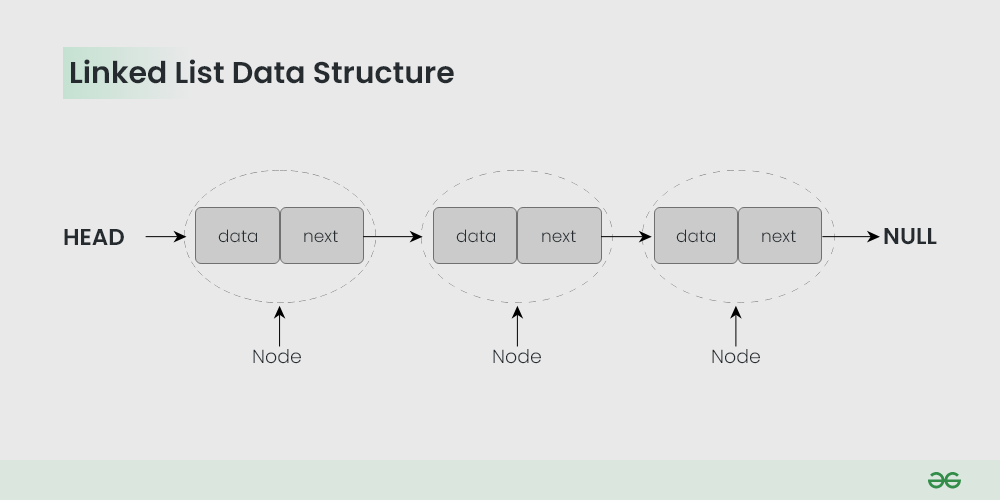

# Linked List:

The LinkedList stores its items in "containers." The list has a link to the first container and each container has a link to the next container in the list. To add an element to the list, the element is placed into a new container and that container is linked to one of the other containers in the list.
## Flow of linked list:


Image source:https://www.geeksforgeeks.org/data-structures/linked-list/

## Description::
 Implemented multiple methods for Linked List

### Iterate Linked List:
```java
//creating method to iterate Linked List
    public void pintList(){
        Node temp=head;
        while (temp!=null){
            System.out.println(temp.value);
            temp=temp.next;
        }
    }
```

### Apend Linked List:
```java
public void append(int value){
        Node newNode= new Node(value);
        if(head==null){
            head=newNode;
            tail=newNode;
        }else{
            //connect this node with previous index of node
            // and node will be connected with tail
            tail.next=newNode;
            tail=newNode;
        }
        index++;
    }
```
### Prepend Linked List:
```java
public void prepend(int value){
        //task: to remove element from first
        // make head to new node
        // connect new added node with list
        //edge case: if head and tail both points to null
        
        Node newNode=new Node(value);
        if (index ==0 ){
            head=newNode;
            tail=newNode;
        }else {
            newNode.next=head;
            head=newNode;
        }
        index++;
    }
```


### Remove first from Linked List:
```java
public Node removeFirst(){
        //edge case: in linked list, element could be single
        if (index==0) return null;
        Node firstNode=head;
        head=head.next;
        firstNode.next=null;
        index--;
        if (index==0){
            tail=null;
        }

        return firstNode;
    }
```

### Remove last from Linked List:
```java
public Node removeLast(){
        // checking if list is null
        //temp element node: which takes node data
        // temp element node: which store previous node
        // iterate list till node.next== null
        //reduce index
        //edge case: if list has only one element (head and tail should be null)
        if (index==0){
            return null;
        }
        Node current=head;
        Node preNode=current;
        while(current.next!=null){
            preNode=current;
            current=current.next;
        }
        tail=preNode;
        tail.next=null;
        index--;

        if(index==0){
            head=null;
            tail=null;
        }

        return current;
    }
```
### Get by index from Linked List:
```java
    public Node get(int index ){

        Node indexedNode=head;
        int i=0;
        if (index>this.index){return null;}
        if (index<0){return null;}
        while(i<=this.index){
            if (index==i){
                return indexedNode;
            }
            indexedNode=indexedNode.next;
            i++;
        }
        return null;
    }
```

### Set at index in Linked List:
```java
    public boolean set(int index,int value){
        Node current=get(index);
        if (current!=null){
            current.value=value;
            return true;
        }
        return false;
    }
```

### Reverse the Linked List:
```java
   public void reverse(){
        Node temp= head;
        head=tail;
        tail=temp;
        Node after=temp.next;
        Node before=null;
        for (int i= 0; i< index; i++){
            after=temp.next;

            temp.next=before;

            before=temp;

            temp=after;

        }
```

### Remove at any index of Linked List:
```java
   public Node remove(int index){
        //remove from first index
        //remove from last index
        //remove from any where
        //decrease size
        //edge case: remove method accept valid test dada
        if (index>this.index || index<0) return null;
        if(index==0){
            return removeFirst();
        }
        if (index==this.index){
            return removeLast();
        }
        Node beforeIndex= get(index-1);//before
        Node selfNode=beforeIndex.next;//slef
        Node afterIndex=selfNode.next;//after

        //OR
        // beforeIndex.next = selfNode.next
        beforeIndex.next=afterIndex;
        selfNode.next=null;
        this.index--;

        return selfNode;
    }
```
### Insert at any index of Linked List:
```java
   public boolean insert (int index, int value){
       if (index<0 || index>this.index){ return false;}
       //if insertion is for first node
       if (index==0){
           prepend(value);
           return true;
       }
        //if insertion is for last node
       if (index==this.index){
           append(value);
           return true;
       }
       //if insertion is for any other index
        //create new node
        Node newNode=new Node(value);
       Node temp=get(index-1);
       newNode.next=temp.next;
       temp.next=newNode;
       this.index++;

        return true;
    }
```

